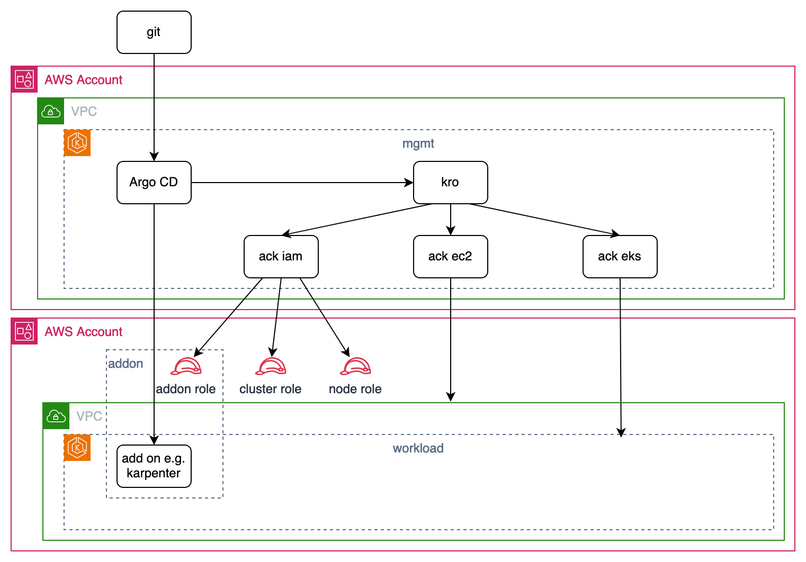

# Amazon EKS cluster management using kro & ACK

This example demonstrates how to manage a fleet of EKS clusters using kro, ACK,
and ArgoCD -- it creates EKS clusters, and bootstraps them with the required
add-ons

A hub-spoke model is used in this example; a management cluster (hub) is created
as part of the initial setup and the controllers needed for provisioning and
bootstrapping workload clusters (spokes) are installed on top.



**NOTE:** As this example evolves, some of the instructions below will be
detailed further (e.g. the creation of the management cluster), others (e.g.
controllers installation) will be automated via the GitOps flow.

## Prerequisites

1. AWS account for the management cluster
2. AWS account for workload clusters; each with the following IAM roles:

   - `eks-cluster-mgmt-ec2`
   - `eks-cluster-mgmt-eks`
   - `eks-cluster-mgmt-iam`

   The permissions should be as needed for every controller. Trust policy:

   ```json
   {
     "Version": "2012-10-17",
     "Statement": [
       {
         "Effect": "Allow",
         "Principal": {
           "AWS": "arn:aws:iam::<mgmt-account-id>:role/ack-<srvc-name>-controller"
         },
         "Action": "sts:AssumeRole",
         "Condition": {}
       }
     ]
   }
   ```

## Instructions

### Environment variables

1. Use the snippet below to set environment variables. Replace the placeholders
   first (surrounded with`<>`):

```sh
export KRO_REPO_URL="https://github.com/kro-run/kro.git"
export WORKSPACE_PATH=<workspace-path> #the directory where repos will be cloned e.g. ~/environment
export ACCOUNT_ID=$(aws sts get-caller-identity --output text --query Account)
export AWS_REGION=<region> #e.g. us-west-2
export CLUSTER_NAME=mgmt
export ARGOCD_CHART_VERSION=7.5.2
```

### Management cluster

2. Create an EKS cluster (management cluster)
3. Create IAM OIDC provider for the cluster:

```sh
eksctl utils associate-iam-oidc-provider --cluster $CLUSTER_NAME --approve
```

4. Save OIDC provider URL in an environment variable:

```sh
OIDC_PROVIDER=$(aws eks describe-cluster --name $CLUSTER_NAME --region $AWS_REGION --query "cluster.identity.oidc.issuer" --output text | sed -e "s/^https:\/\///")
```

5. Install the following ACK controllers on the management cluster:
   - ACK IAM controller
   - ACK EC2 controller
   - ACK EKS controller

   **NOTES:** 
   - Make sure to enable CARMv2 by setting the feature flags `ServiceLevelCARM` and `TeamLevelCARM` to true.
   - Make sure to grant IAM permissions to assume role in workload cluster accounts

6. Install kro on the management cluster. Please note that this example is
   tested on 0.1.0.
```sh
helm install kro oci://public.ecr.aws/kro/kro \
  --namespace kro \
  --create-namespace \
  --version=0.1.0
```
7. Install EKS pod identity add-on:

```sh
aws eks create-addon --cluster-name $CLUSTER_NAME --addon-name eks-pod-identity-agent --addon-version v1.0.0-eksbuild.1
```

### Repo

8. Clone kro repo:

```sh
git clone $KRO_REPO_URL $WORKSPACE_PATH/kro
```

9. Create the GitHub repo `cluster-mgmt` in your organization; it will contain
   the clusters definition, and it will be reconciled to the management cluster
   via the GitOps flow

10. Save the URL of the created repo in an environment variable:

```sh
export MY_REPO_URL=<repo-url> #e.g. https://github.com/iamahgoub/cluster-mgmt.git
```

11. Clone the created repo:

```sh
git clone $MY_REPO_URL $WORKSPACE_PATH/cluster-mgmt
```

12. Populate the repo:

```sh
cp -r $WORKSPACE_PATH/kro/examples/eks-cluster-mgmt/* $WORKSPACE_PATH/cluster-mgmt

find $WORKSPACE_PATH/cluster-mgmt -type f -exec sed -i "s~ACCOUNT_ID~$ACCOUNT_ID~g" {} +
find $WORKSPACE_PATH/cluster-mgmt -type f -exec sed -i "s~MY_REPO_URL~$MY_REPO_URL~g" {} +
find $WORKSPACE_PATH/cluster-mgmt -type f -exec sed -i "s~AWS_REGION~$AWS_REGION~g" {} +
find $WORKSPACE_PATH/cluster-mgmt -type f -exec sed -i "s~CLUSTER_NAME~$CLUSTER_NAME~g" {} +
find $WORKSPACE_PATH/cluster-mgmt -type f -exec sed -i "s~OIDC_PROVIDER~$OIDC_PROVIDER~g" {} +
```

13. Push the changes

```sh
cd $WORKSPACE_PATH/cluster-mgmt
git add .
git commit -m "initial setup"
git push
cd $WORKSPACE_PATH
```

### ArgoCD installation

14. Create an IAM role for ArgoCD on the management cluster and associated with
    ArgoCD `ServiceAccount`:

```sh
cat >argocd-policy.json <<EOF
{
    "Version": "2012-10-17",
    "Statement": [
        {
            "Action": [
                "sts:AssumeRole",
                "sts:TagSession"
            ],
            "Effect": "Allow",
            "Resource": "*"
        }
    ]
}
EOF

aws iam create-policy --policy-name argocd-policy --policy-document file://argocd-policy.json

cat >argocd-trust-relationship.json <<EOF
{
    "Version": "2012-10-17",
    "Statement": [
        {
            "Sid": "AllowEksAuthToAssumeRoleForPodIdentity",
            "Effect": "Allow",
            "Principal": {
                "Service": "pods.eks.amazonaws.com"
            },
            "Action": [
                "sts:AssumeRole",
                "sts:TagSession"
            ]
        }
    ]
}
EOF

aws iam create-role --role-name argocd-hub-role --assume-role-policy-document file://argocd-trust-relationship.json --description ""
aws iam attach-role-policy --role-name argocd-hub-role --policy-arn=arn:aws:iam::$ACCOUNT_ID:policy/argocd-policy

aws eks create-pod-identity-association --cluster-name $CLUSTER_NAME --role-arn arn:aws:iam::$ACCOUNT_ID:role/argocd-hub-role --namespace argocd --service-account argocd-application-controller
```

15. Install ArgoCD helm chart:

```sh
helm repo add argo-cd https://argoproj.github.io/argo-helm
helm upgrade --install argocd argo-cd/argo-cd --version $ARGOCD_CHART_VERSION \
  --namespace "argocd" --create-namespace \
  --set server.service.type=LoadBalancer \
  --wait
```

### Bootstrapping

16. Create ArgoCD `Repository` resource that points to `cluster-mgmt` repo
    created in an earlier instruction
17. Apply the bootstrap ArgoCD application:

```sh
kubectl apply -f $WORKSPACE_PATH/cluster-mgmt/gitops/bootstrap.yaml
```

### Adding workload clusters

18. Add the cluster name and corresponding account number in
    `charts-values/ack-multi-account/values.yaml`.
19. Commit/push the changes to Git, then wait for the sync operation to complete by checking ArgoCD UI.
20. Add a workload cluster by adding a manifest for it under `clusters/`. Refer to `clusters/workload1.yaml` as an example.
21. Include the new cluster manifest in `clusters/kustomization.yaml`.
22. Commit/push the changes to Git, then wait for the sync operation to complete by checking ArgoCD UI. Finally, log on to the workload cluster account to confirm that the cluster is created as expected.

## Clean-up

1. Delete ArgoCD bootstrap application, and wait for workload clusters and
   hosting VPCs to be deleted:

```sh
kubectl delete application bootstrap -n argocd
```

2. Uninstall ArgoCD helm chart

```sh
helm uninstall argocd -n argocd
```

3. Delete ArgoCD IAM role and policy

```sh
aws iam delete-role --role-name argocd-hub-role
```

4. Delete ArgoCD IAM policy

```sh
aws iam delete-policy --policy-arn arn:aws:iam::$ACCOUNT_ID:policy/argocd-policy
```

5. Delete ACK controllers and kro
6. Delete the management cluster
